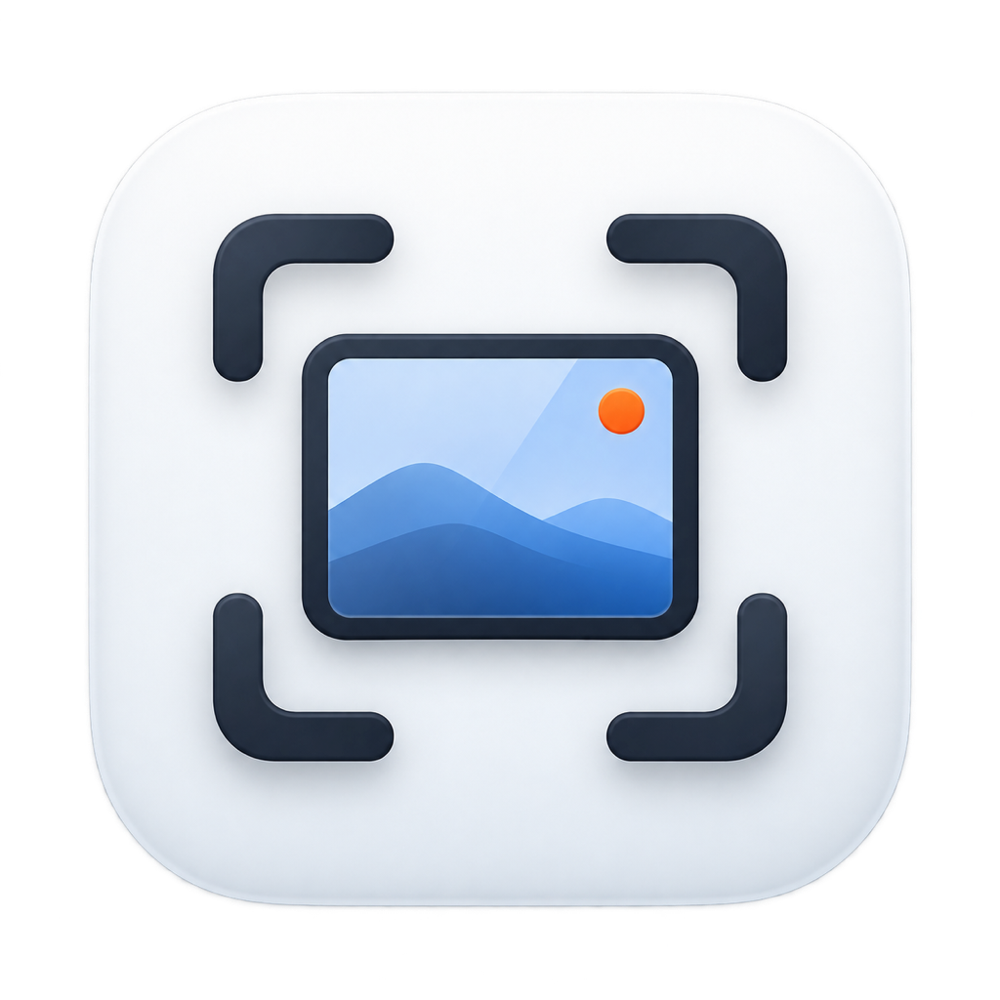

<p align="center">
  
</p>

<h1 align="center">HoldImg</h1>

<p align="center">
A GrabIt/Snipaste-style floating screenshot utility for macOS.<br>
Capture a region and it instantly appears as an image panel that floats above every window.
</p>

<p align="center">
  <a href="README.md">English</a> · <a href="README.ko.md">한국어</a> ·
  <a href="https://jaymunsh.github.io/hold-img/manual-en.html">User Guide</a> ·
  <a href="https://github.com/jaymunsh/hold-img/releases">Releases</a> ·
  <a href="CHANGELOG.md">Changelog</a>
</p>

## Install

Download `HoldImg.app.zip` from [Releases](https://github.com/jaymunsh/hold-img/releases), unzip it, and move the app to `/Applications`.

> **First launch**: because the app ships without an Apple Developer Program
> signature, Gatekeeper may warn about an "unidentified developer."
> **Right-click → Open** the app once to get past it, or run:
>
> ```bash
> xattr -d com.apple.quarantine /Applications/HoldImg.app
> ```
>
> On the first capture, macOS will ask for **Screen Recording** permission —
> it is required for any screenshot tool. Everything is processed locally;
> no data leaves your Mac.

## Build & Run

```bash
make build   # swift build -c release → assemble + sign build/HoldImg.app
make run     # build then launch
```

The `.app` bundle is produced with SwiftPM + `Scripts/build-app.sh` — no Xcode required.

### Signing

If `~/.local/share/holdimg-dev/holdimg.keychain-db` contains a "HoldImg Local Dev"
self-signed certificate, the script signs with it — the signing identity survives
rebuilds so your Screen Recording permission is not reset. Otherwise it falls
back to ad-hoc signing, which requires re-granting permission on every build.

The keychain password is never committed. The script reads it from the
`HOLDIMG_KEYCHAIN_PASSWORD` environment variable or
`~/.local/share/holdimg-dev/keychain-password` (chmod 600).

<details><summary>Create a local development certificate</summary>

```bash
mkdir -p ~/.local/share/holdimg-dev && cd ~/.local/share/holdimg-dev
openssl req -x509 -newkey rsa:2048 -keyout key.pem -out cert.pem \
  -days 3650 -nodes -subj "/CN=HoldImg Local Dev" \
  -addext "extendedKeyUsage=codeSigning" \
  -addext "basicConstraints=critical,CA:TRUE" \
  -addext "keyUsage=critical,digitalSignature"
openssl pkcs12 -export -out cert.p12 -inkey key.pem -in cert.pem -password pass:<password>
security create-keychain -p <password> holdimg.keychain-db
security import cert.p12 -k holdimg.keychain-db -P <password> -T /usr/bin/codesign
security import cert.pem -k holdimg.keychain-db -T /usr/bin/codesign
security set-key-partition-list -S apple-tool:,apple: -s -k <password> holdimg.keychain-db
printf '%s' '<password>' > keychain-password && chmod 600 keychain-password
```

For public releases use an Apple Developer ID certificate + notarization.
</details>

## First Run — Screen Recording Permission

On your first capture attempt macOS asks for Screen Recording permission.
Click "Open Settings" in the app's prompt, or enable HoldImg under
System Settings → Privacy & Security → Screen Recording, then capture again.
(An app restart may be required after changing the permission.)

## Features

- **Region capture** `⌃⌥C` — the screen freezes; drag to select a region → instantly floats (native Retina 2x resolution)
  - Aspect ratio: `1` free · `2` 1:1 · `3` 4:3 · `4` 16:9 · `5` 16:10 — pressing one mid-drag reshapes the selection on the fly
  - `6` enter a pixel size (e.g. `1920x1080`) → a fixed-size box follows the cursor; click to capture
- **Window capture** `⌃⌥W` — hover to highlight a window, click to capture
- **Recapture last region** `⌃⌥R` — instantly reshoot the same region
- **Paste from clipboard** `⌃⌥V` — float an image already on the clipboard
- **Hide/show all panels** `⌃⌥H` — tuck every floating panel away and bring them back
- **Restore closed panel** `⌃⌥Z` — reopen recently closed panels in place (up to 10)
- Open image files (JPG/PNG…) as floating panels — like a picture frame
- In the capture overlay, `M` toggles the loupe (off by default) and `C` copies the pixel's HEX color
- Top hint bar: action chips (M Loupe · C Copy color · Esc Cancel) + ratio chips (`1. Free`–`6. Custom`, current ratio highlighted)

> 📖 For detailed usage with screenshots, see the
> **[User Guide](https://jaymunsh.github.io/hold-img/manual-en.html)**.

## Floating Panel Controls

| Action | How |
|---|---|
| Move | Drag (auto-snaps to screen/other panel edges & centers); arrow keys nudge 1pt, `⇧`+arrows 10pt |
| Rotate/flip | `R` rotate 90° CW, `⇧R` CCW, `F` flip horizontal — applied to the image itself |
| Drag out as file | Right-click drag — drop into Finder/Slack/Mail as an image file |
| Resize | Scroll (zoom at cursor) or drag corners/edges — aspect ratio locked by default; `L` or the toolbar 🔒 unlocks it. A dimension badge shows while resizing |
| Collapse/restore | Double-click — folds into a thumbnail and back |
| Copy image | Click or `⌘C` |
| Save | `⌘S` (PNG/JPEG) |
| Annotate | `P` — enter annotation mode (tools below) |
| Extract text (OCR) | Toolbar OCR button or right-click menu — Vision recognition → clipboard |
| Always on top | `T` or right-click menu |
| Click-through | `G` or right-click menu (mouse passes through the panel) |
| Opacity | `⌥`+scroll or right-click menu |
| Close | `⌘W` or `Esc` |

Hovering over a panel reveals a toolbar at the top right — pen · copy ·
save · OCR · aspect lock · close.

Annotation mode (`P`) offers **pen (freehand) · highlighter (translucent band) ·
arrow · rectangle · mosaic · text**, four colors, undo (`⌘Z`), and clear-all.
Mosaic is handy for redacting sensitive info; text is typed right where you
click. Pressing done (✓) bakes annotations into the image at native
resolution so copies and saves include them. `Esc`/`P` discards and exits.

The menu bar icon provides recent capture history, close-all, click-through
reset, settings, and a shortcuts cheat sheet. Every shortcut can be
reassigned in Settings.

## Localization

The UI is available in **Korean and English**. Settings → Language lets you
pick System Default, 한국어, or English.

## Version History

See [CHANGELOG.md](CHANGELOG.md) for the full update log, or browse
[GitHub Releases](https://github.com/jaymunsh/hold-img/releases) — the same
link is available at the bottom of HoldImg's Settings window.

## License

MIT — see [LICENSE](LICENSE). Built with
[KeyboardShortcuts](https://github.com/sindresorhus/KeyboardShortcuts) (MIT).
